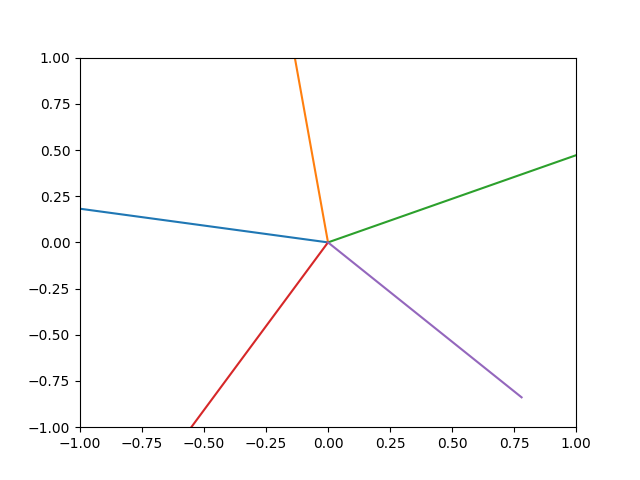
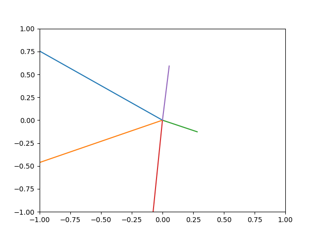
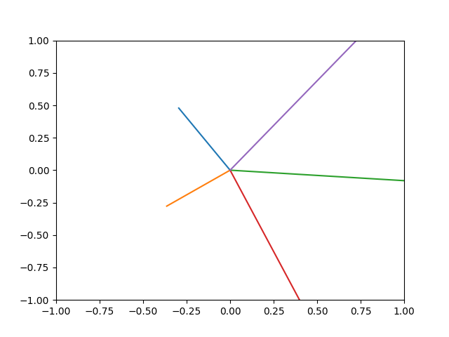

# Research into Superposition

This test folder consists of a reproduction and extension of the analysis found in anthropic's work on "superposition" ("polysemanticity"), which is available [here](https://transformer-circuits.pub/2022/toy_model/index.html).

## Reproduction

First, we can reproduce one of the more interesting graphics from the piece. The authors find that the toy-model learns to orient the column vectors of its weight matrix into defined geometric structures. These structures maximize the amount of information that the down-projection can contain about the original input. Strikingly, if we have have a down projection from 5 features to 2, the column vectors of the weight matrix form a pentagonal shape:

## Extension

The word "toy" in Anthropic's description of its model is doing a lot of work, unfortunately. In order to simplify the analysis (and because it makes "intuitive sense" and is "mathematically principled", according to the authors), the weights in the up and down projections are shared (the up projection is the transpose matrix of the down projection). Moreover, the Relu activation function is applied at the very end, rather than in between the projections. This makes the setup easier to analyze, but it is completely unapplicable to real neural network architectures. Charitably, the authors note that the results could apply more directly to specific elements of large models, such as the embedding layer.

We want to study polysemanticity in a more realistic context. First, we change the architecture so that the up-projection weights are not shared. This change improves the model. The minimum loss in training runs of the original architecture was $\approx0.50$. In training runs of the architecture with unshared weights, the minimum loss was $\approx0.15$. The pretty picture changes slightly:

And we have a new picture to look at, which is the rows of the second weight matrix:

